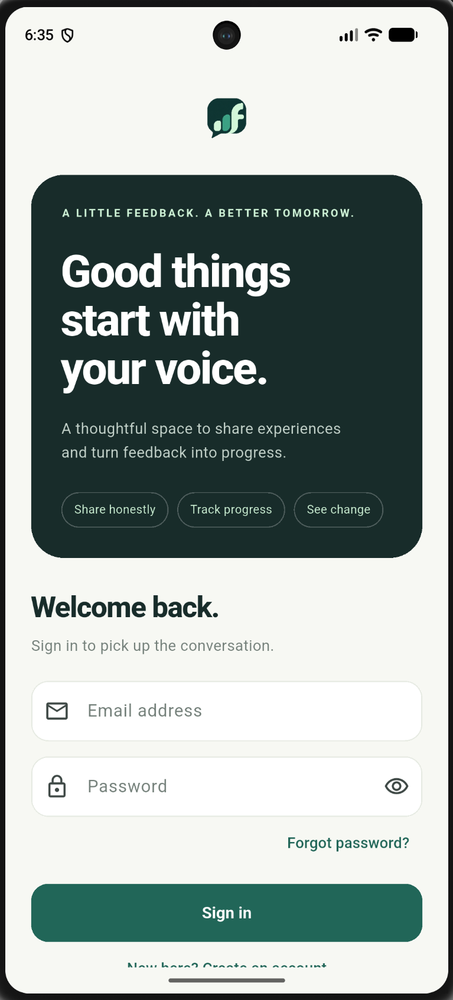
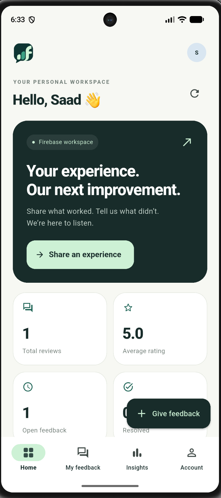
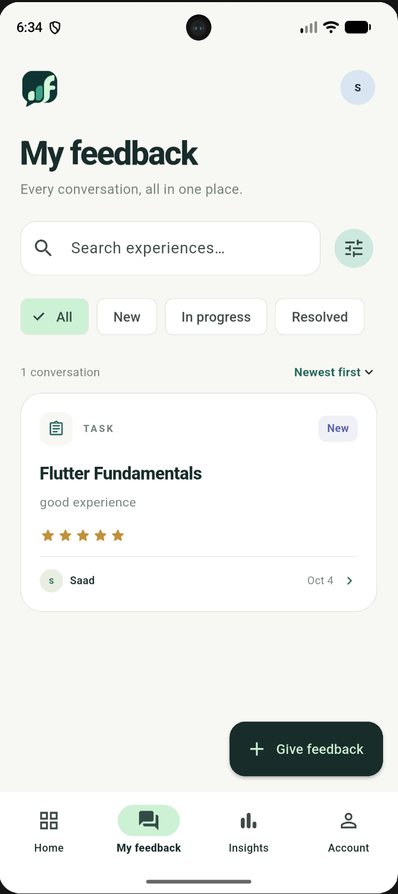
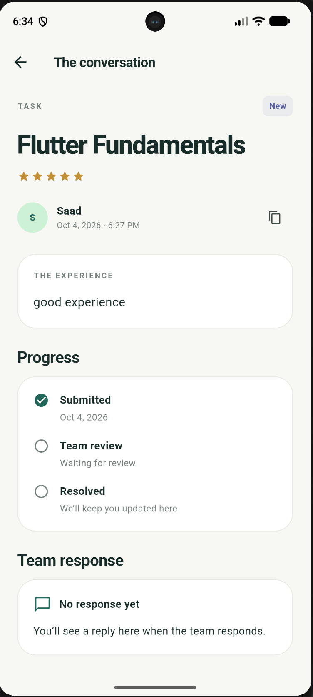
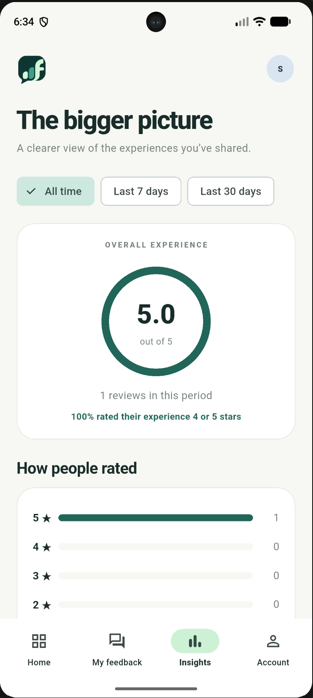
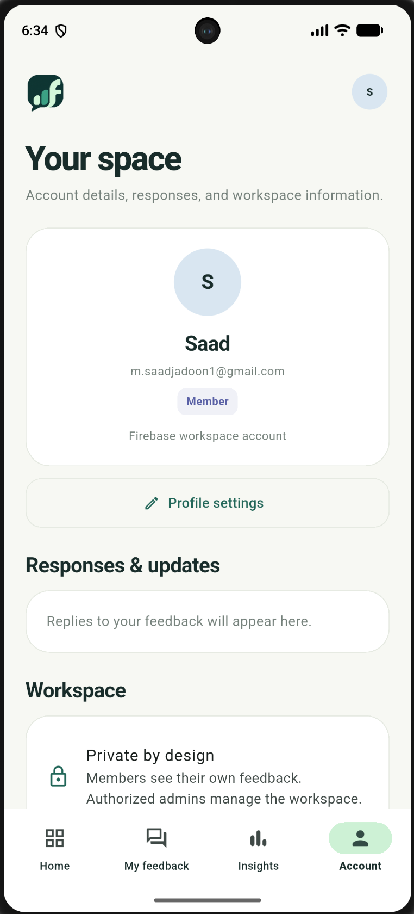
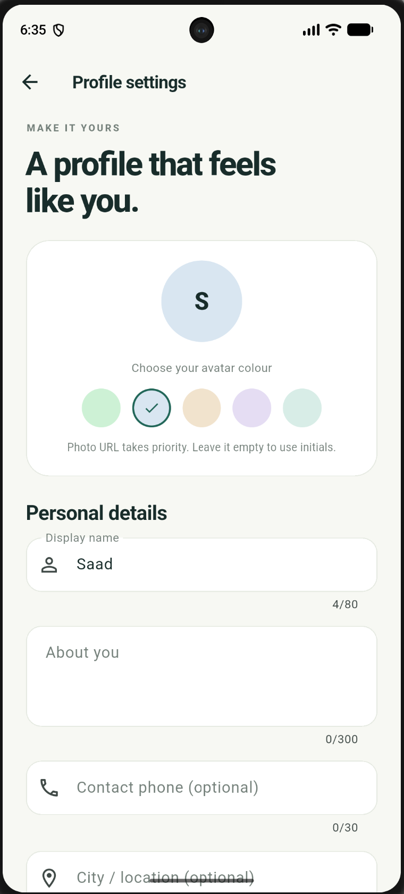
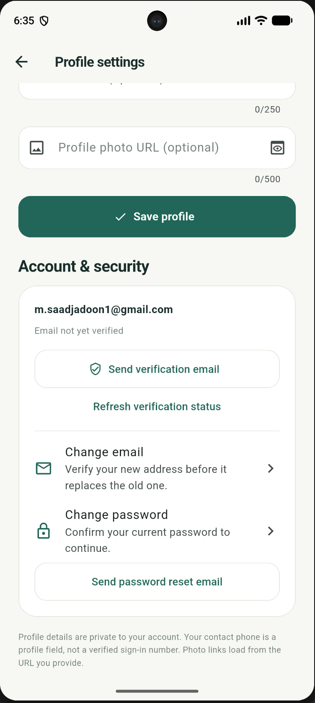
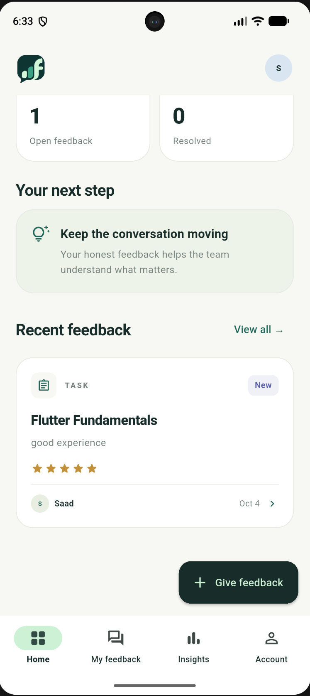

<div align="center">
  
  <h1>Feedback</h1>
  <p><strong>A little feedback. A better tomorrow.</strong></p>
  <p>A Flutter workspace for sharing experiences, tracking progress and turning feedback into a conversation.</p>
  
  
  
</div>

## Overview

Built by **Muhammad Saad Jadoon** for the second Flutter internship task at **Internee.pk**, Feedback combines a member workspace with an administrator review workflow. Members submit ratings, experiences and suggestions; authorized administrators review submissions, update their status and respond.

The interface uses forest green, mint and warm ivory, with a symbol-only identity, responsive navigation and readable cards. The supplied screenshots below show the author's Android application, including its Firebase workspace. They are presentation evidence, not automated test results.

**Two ways to explore:** an in-memory demo that needs no Firebase account, or a live workspace backed by Firebase Authentication and Cloud Firestore.

## Screenshots

<table>
  <tr>
    <td align="center"><br/><strong>Welcome back</strong></td>
    <td align="center"><br/><strong>Member dashboard</strong></td>
    <td align="center"><br/><strong>My feedback</strong></td>
    <td align="center"><br/><strong>The conversation</strong></td>
  </tr>
  <tr>
    <td align="center"><br/><strong>Experience insights</strong></td>
    <td align="center"><br/><strong>Your space</strong></td>
    <td align="center"><br/><strong>Personal details</strong></td>
  </tr>
  <tr>
    <td align="center"><br/><strong>Account and security</strong></td>
    
    <td align="center"><br/><strong>Recent experiences</strong></td>
  </tr>
</table>

## Features

| Area | Included behaviour |
| --- | --- |
| Authentication | Email/password registration, sign-in, sign-out and password reset |
| Feedback | Guided three-step submission, 1–5 stars, Task/Course/Service categories, experience and optional suggestion |
| Inbox | Text search, status/category/rating/time filters and date/rating sorting |
| Conversations | Review detail, current progress and live administrator response |
| Administration | Workspace-wide feedback, status changes and response editing for trusted administrators |
| Insights | Average rating, rating distribution, positive-feedback percentage, resolution metrics and CSV copying |
| Profile | Display name, bio, phone, location, website, avatar colour and HTTPS photo URL |
| Account security | Email verification, verification refresh, password change and verified email-change flow |
| Layout | Mobile bottom navigation, wider-screen navigation rail and adaptive forms |
| Demo | Separate member/admin experiences with sample data and in-memory changes |

## Quick start — demo

Install **Flutter 3.35 or newer with Dart 3.9+**. Android development also requires Android Studio, its SDK and an emulator or USB-connected device. iOS development requires macOS and Xcode. Dependency installation requires internet access.

Open the folder containing `pubspec.yaml` in VS Code or Android Studio, then run:

```powershell
flutter doctor
# One-time setup: creates official Android, iOS and web runners.
dart tool/setup.dart
flutter analyze
flutter test
flutter devices
flutter run --dart-define=DEMO_MODE=true
```

If several devices are available, use `flutter run -d YOUR_DEVICE_ID --dart-define=DEMO_MODE=true`. For a browser, use `flutter run -d chrome --dart-define=DEMO_MODE=true`.

On the welcome screen, scroll to the demo options and choose member or administrator. Demo changes reset when the app restarts; account security actions require Firebase mode.

**Why setup comes first:** this source archive intentionally supplies application code and a runner generator. The initial ZIP has no native runner folders. `tool/setup.dart` uses your installed Flutter SDK to create them, restores the supplied source, installs packages, sets the launcher branding and adds Android internet permission. It skips runner creation when all three platform folders already exist. Back up native customizations before running setup on an existing project.

Windows shortcut: `.\SETUP_WINDOWS.cmd` (or simply use the Dart command above). macOS/Linux shortcut: `bash SETUP.sh`.

## Connect a real Firebase workspace

### 1. Prepare the backend

In [Firebase Console](https://console.firebase.google.com/), select your project, enable **Authentication → Email/Password**, and create the default **Cloud Firestore** database.

Install and sign in to the command-line tools. On Windows PowerShell, use `.cmd` to avoid the blocked `.ps1` wrapper:

```powershell
npm.cmd install -g firebase-tools
firebase.cmd login
dart pub global activate flutterfire_cli
dart pub global run flutterfire_cli:flutterfire configure
```

Select the intended project and Android. If an existing bare `firebase.json` does not contain your platform app settings, choose **No** when asked to reuse it. Native app registration must match the generated application ID; the default is `com.feedbackstudio.feedback_studio`.

### 2. Provide the app's configuration

If you already have a working `firebase.android.json`, copy it into this project root. Otherwise:

```powershell
Copy-Item firebase.android.example.json firebase.android.json
```

Replace the placeholders using the **Android** options in the generated `lib/firebase_options.dart`:

| JSON key | Generated Firebase option |
| --- | --- |
| `FIREBASE_API_KEY` | `apiKey` |
| `FIREBASE_APP_ID` | `appId` |
| `FIREBASE_SENDER_ID` | `messagingSenderId` |
| `FIREBASE_PROJECT_ID` | `projectId` |

Keep `DEMO_MODE` as `"false"`. This app initializes Firebase from compile-time JSON values; the generated options file alone does not switch the app to live mode.

For web or iOS, create a separate platform JSON from that platform's options. Web needs its `authDomain`; iOS needs its matching `iosBundleId`. Do not reuse an Android app ID for another platform.

### 3. Deploy access rules and run

```powershell
$config = Get-Content .\firebase.android.json -Raw | ConvertFrom-Json
firebase.cmd deploy --only firestore --project $config.FIREBASE_PROJECT_ID
flutter run --dart-define-from-file=firebase.android.json
```

Use `-d YOUR_DEVICE_ID` if needed. Sign up with a real account, submit feedback, then save your profile. Sign out and back in to check persistence. Profile documents are created on the first successful save.

## Administrator access

Live administrator access requires a trusted Firebase Authentication custom claim: `admin: true`. A profile document cannot grant this role.

Run the included helper only in a trusted local environment with Application Default Credentials for the correct Firebase project:

```powershell
npm.cmd install --no-save firebase-admin
node tool/grant_admin.mjs USER_UID
```

After assigning the claim, sign out and sign back in. See [Firebase custom claims](https://firebase.google.com/docs/auth/admin/custom-claims) for trusted credential setup. Never put Admin SDK credentials in the Flutter application.

## Build and validate

```powershell
flutter analyze
flutter test --reporter expanded
flutter build apk --release --dart-define-from-file=firebase.android.json
```

The APK is written to `build/app/outputs/flutter-apk/app-release.apk`. Configure your own release signing before distribution through a store.

For a shareable demo web build:

```powershell
flutter build web --dart-define=DEMO_MODE=true
```

Output is `build/web/`; building does not publish a website or create a public URL. A live web build requires the matching `firebase.web.json` and `--dart-define-from-file=firebase.web.json`.

## Repository guide

| Path | Purpose |
| --- | --- |
| `lib/main.dart` | Startup, Firebase initialization and app root |
| `lib/store.dart` | Session, authorization and feedback/profile operations |
| `lib/screens.dart` | Dashboard, inbox, insights and account workspace |
| `lib/review_screens.dart` | Submission and conversation screens |
| `lib/profile_screen.dart` | Profile editor and security actions |
| `lib/design.dart` | Shared theme and presentation components |
| `lib/model.dart`, `lib/filters.dart`, `lib/profile_data.dart` | Models, insights, filtering and profile validation |
| `test/` | Unit and widget tests for demo flows, insights, filters and profiles |
| `assets/branding/` | Logo and launcher icon source |
| `docs/screenshots/` | All nine supplied screenshots |
| `firestore.rules` | Owner-scoped feedback and private profile permissions |
| `tool/setup.dart` | Platform generation, dependencies and launcher setup |
| `.vscode/launch.json` | Separate demo and Firebase Android launch profiles |
| `.github/workflows/flutter.yml` | Analysis, tests and demo web build on GitHub |

After setup, `android/`, `ios/` and `web/` appear at the repository root. Commit these generated platform sources and `pubspec.lock` to make subsequent clones easier to run. Keep machine-specific caches and credentials out of git.

## Troubleshooting

| Symptom | What to check |
| --- | --- |
| No Android/iOS/web target | Run `dart tool/setup.dart` from the project root |
| `flutter` or `dart` not recognized | Add the Flutter `bin` directory to PATH, then reopen the terminal |
| `firebase.ps1` is blocked | Use `firebase.cmd`; use `npm.cmd` for npm |
| JSON file not found | Create the filled JSON next to `pubspec.yaml`; run from that folder |
| App opens in demo mode | Select the Firebase launch profile or pass the JSON flag |
| Profile needs attention | Deploy the included `users/{uid}` rules to the same project; check sign-in and connectivity |
| Admin screen unavailable | Check the trusted claim and sign out/sign in |
| No device listed | Start an Android Studio emulator or enable USB debugging; run `flutter devices` |
| Old icon remains | Rebuild and reinstall; uninstalling the old test app removes its local app data |

## Scope and verification

The packaging checks cover Dart syntax parsing, local imports, configuration parsing, screenshot paths and archive integrity. **Flutter analysis, tests, native runner generation and builds were not executed in the packaging environment because Flutter was unavailable.** The GitHub workflow runs those checks when uploaded; its result must be reviewed before claiming a passing build. No passing-build badge is asserted here.

Included tests exercise analytics, filters, demo role separation, feedback submission/admin response and small-screen profile editing. Live Firebase permission and account-security flows still need testing against your own project.

Current boundaries: profile photos use HTTPS URLs rather than gallery uploads; contact phone is not phone authentication; inbox “show more” limits rendered cards while its Firestore listener still loads all accessible reviews; profile and Authentication name updates are separate service writes. Existing review author names remain historical. There is no push-notification or store-release pipeline.

## Before publishing

The screenshots intentionally include the author's name and email. Review them if you want different information shown in a public repository. The ignore rules exclude local Firebase JSON files, signing keys and common service-account filenames; inspect `git status` before your first commit. Runtime permissions are enforced by Firestore rules and trusted claims.

A license has not been selected for you. Add the license you intend before inviting reuse.

## References

- [Flutter installation](https://docs.flutter.dev/get-started/install)
- [Flutter project creation](https://docs.flutter.dev/reference/create-new-app)
- [Firebase Flutter setup](https://firebase.google.com/docs/flutter/setup)
- [Flutter testing](https://docs.flutter.dev/testing/overview)

---

**Muhammad Saad Jadoon** · Flutter internship project · Internee.pk
